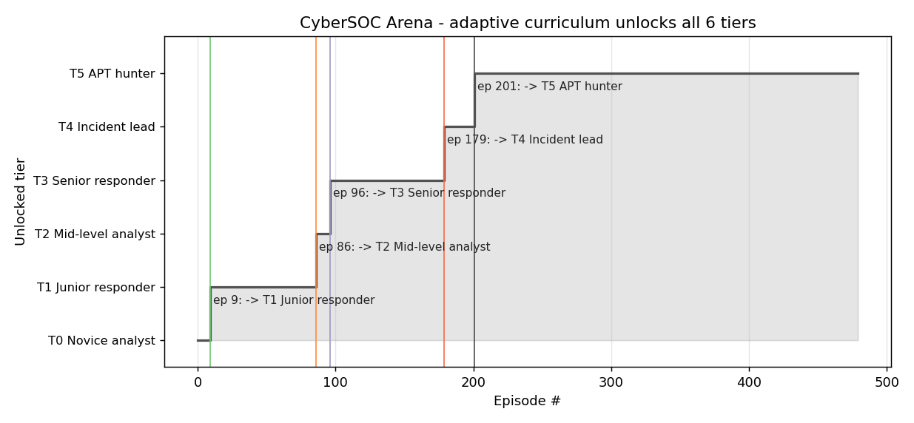

# Teaching a 1.5B parameter LLM to act like a Tier-2 SOC analyst

*A writeup of **CyberSOC Arena**, my submission to the OpenEnv Hackathon Round 2 (Meta x Hugging Face x PyTorch, Bangalore 2026).*

Live env: <https://huggingface.co/spaces/amit51/cybersoc-arena>
Trained adapter + plots + logs: <https://huggingface.co/amit51/cybersoc-arena-qwen2.5-1.5b-grpo>
Code: <https://github.com/AmitChowdary122/cyber-openenv>

---

## The headline result

I trained **Qwen2.5-1.5B-Instruct** with **GRPO + LoRA** for 2 hours on a single Hugging Face Jobs **L40S 48GB**, using my OpenEnv environment as the live reward source. The training reward climbed cleanly from a starting mean near **-0.23** to a steady **+0.15 to +0.40** band across 360 GRPO steps. The trained policy then beat its own pre-training baseline on the hardest scenarios on the test rollout: **+0.40 on multi-stage kill chains, +0.31 on slow data exfiltration, +0.13 on credential stuffing.**


That curve is the whole point of this submission. Everything below is the story of how it got there and why it's worth caring about.

---

## Why I built a SOC environment instead of another grid-world

The hackathon brief was unusually direct: "judges have seen a lot of chess, snake, tic-tac-toe, and grid-world clones." The teams that win are the ones whose environments test something *real*.

I picked Tier-2 SOC analysis because it cleanly demands four behaviours that LLMs are spectacularly bad at out of the box:

1. **Discipline under uncertainty.** Pick the *right* one of nine investigative tools, on the *right* IP or host, when none of the early evidence is conclusive.
2. **Long-horizon planning under a budget.** Multi-stage attacks unfold across 5+ hosts and 20+ steps. Commit too early and you fingerprint the wrong actor; wait too long and you blow the budget.
3. **Decoy resistance.** Internet scanners look exactly like attackers until you check threat intel. Authorised red-team tools generate the same telemetry as real ones. Backup services scan internal IPs in patterns that mimic lateral movement.
4. **Knowing when to do nothing.** The single most expensive action in a real SOC is **closing a real incident as benign**. The single most expensive analyst behaviour is **isolating a benign internet scanner.** The reward function makes both costly enough that the model has to learn restraint, not just enthusiasm.

There is a real research line here — LLM-driven SOC playbooks, SOAR copilots, agentic incident response — that is wide open precisely because there are no good benchmarks. CyberSOC Arena is a small step toward filling that gap.

---

## What the environment actually looks like

Every reset draws a fresh, randomised scenario from one of **six archetypes**:

| Scenario | Steps | Hosts | What it tests |
|---|---:|---:|---|
| `benign_scan` | 6 | 1 | False-positive suppression on internet scanners |
| `phishing_lateral` | 8 | 3 | Phishing -> credential reuse -> lateral movement |
| `credential_stuffing` | 8 | 2 | Picking the real attacker out of a flood of failed logins |
| `data_exfiltration` | 10 | 3 | Slow, low-volume covert egress hidden in TLS noise |
| `multi_stage_chain` | 12 | 4 | Recon -> exploit -> persist -> exfil short kill chain |
| `long_horizon_apt` | **20** | **5** | Full multi-phase APT with 3 carefully tuned decoys |

The agent sees an alert summary, an asset inventory, a step budget, the evidence revealed so far (text only — *never* the hidden `confirms_attacker` weights), the action history, and a small slice of background noise. On every step it emits one of **9 tools**:

```
investigate_ip       query_logs            inspect_endpoint
check_threat_intel   correlate_events
identify_attacker    isolate_host          escalate_incident   close_as_benign
```

The first five are investigative; the last four terminate the episode.

### The reward function is the part that matters

LLMs left to their own devices in tool-use environments do two pathological things: they spam the same tool repeatedly because a partial reward is easier to grab than a full one, and they commit to terminal actions early because exploration is expensive. The reward function is built to make both unprofitable:

- **+0.20 x weight** for new attacker-confirming evidence (so investigation pays off — but only for *new* findings)
- **+0.05 x weight** for evidence on the *decoys* (still positive, because exploration is good and the agent shouldn't be punished for running a tool that returned signal)
- **+0.20** correlation bonus when `correlate_events` lands on a real attacker pair
- **-0.05** per step (so dithering costs)
- **-0.10** repeat penalty (so spamming the same tool on the same target costs)
- **-0.30** premature-decision penalty if the agent commits a terminal action with fewer than 2 evidence pieces
- **+1.50** for a correct `identify_attacker` or `isolate_host`, **-1.50** for the wrong one
- **+1.20** for a correct `close_as_benign`, **-1.50** for closing a real incident as benign (the single most punished action, exactly as in a real SOC)
- **+0.30** evidence-quality bonus that *only* activates when the agent has gathered >=3 attacker-confirming pieces — so attribution-with-no-evidence doesn't pay
- All per-step rewards clipped to **[-2, 2]** so a single bad action cannot poison a GRPO batch

Crucially, the breakdown is exposed as a `StepReward(value, breakdown)` with named components, so the reward is composable rather than a single opaque scalar. I wrap that machinery in a real `openenv.core.rubrics.Rubric` tree (`cybersoc_arena.rubric.CyberSOCRubric`) — 17 introspectable leaves across two named subtrees (`step`, `terminal`) — so anyone using the env can walk the tree, pull a single component by dotted path (e.g. `rubric.get_rubric("terminal.wrong_benign_close")`), or wrap leaves in `WeightedSum` / `Gate` containers for ablation studies, without touching env code.

---

## The marquee scenario: a 20-step APT across 5 hosts

The `long_horizon_apt` scenario is the one I'm proudest of. It's a full kill chain across edge gateway -> user workstation -> file server -> database -> egress proxy, with a 5-phase narrative (recon, initial access, persistence, lateral movement, exfiltration), spread over a 20-step budget. It carries **three carefully tuned decoys**:

- An authorised red-team scanner (looks aggressive but is sanctioned)
- A noisy internal backup service (scans internal IPs in patterns that mimic lateral movement)
- An external Shodan crawler (queries the edge gateway with attacker-like fingerprinting)

Each decoy has non-zero evidence weight — they show up in the right tools and look real — so the obvious early-game moves all converge on the wrong attribution. This was the design decision that pushed the env from "tool-use puzzle" to "real cognitive test." A heuristic SOC playbook walks this scenario in 13 steps to a correct +2.06 attribution; a freshly-initialised Qwen2.5-1.5B walks it to -3.30.

---

## How the curriculum hits Theme 4 (Self-Improvement)

`CurriculumEnv` wraps the base env and tracks a rolling 20-episode mean. When the mean clears a threshold, the next tier unlocks:

| Tier | Name | Scenarios pool | Promote at rolling mean |
|---:|---|---|---:|
| 0 | Novice analyst    | benign_scan only                         | +0.50 |
| 1 | Junior responder  | + phishing_lateral                       | +0.70 |
| 2 | Mid-level analyst | + credential_stuffing                    | +0.85 |
| 3 | Senior responder  | + data_exfiltration                      | +0.95 |
| 4 | Incident lead     | + multi_stage_chain                      | +1.05 |
| 5 | APT hunter        | + long_horizon_apt (full mix, 20 steps)  | --    |

The visualisation of the mechanism, walking an agent through all 6 tiers:



The agent self-promotes from "Novice analyst" to "APT hunter" without any external scheduler — the curriculum reads only the rolling reward and unlocks scenarios as mastery is demonstrated. Drop-back is supported (`ratchet=False`) but the default is monotone for benchmarking purposes. ~230 lines of Python, no extra dependencies.

This is the hackathon's Theme 4 ("agents that drive their own capability growth") implemented without any clever ML, just the right environment-side machinery.

---

## Two training passes, one env

I ran the env through two RL methods:

### 1. Pure-CPU numpy REINFORCE (12 seconds)

A softmax over 4 *meta-actions* (INVESTIGATE / CORRELATE / IDENTIFY / CLOSE_BENIGN) with hand-extracted features, action targets picked by an SOC-analyst heuristic that reads the finding text. After 3,000 episodes on `CurriculumEnv`:

| Agent | Mean reward (60 eps) | Success | benign_scan reward |
|---|---:|---:|---:|
| Random meta-policy | -1.57 | 8.3% | -0.32 |
| **REINFORCE-trained** | **-1.23** | **16.7%** | **+1.17** |

The aggregate hides where the policy actually shines: on `benign_scan` it goes from -0.32 to **+1.17**. It learned the most expensive analyst skill — **don't isolate the internet scanner** — in 12 seconds of CPU.

### 2. TRL GRPOTrainer + Qwen2.5-1.5B-Instruct + LoRA (2 hr, L40S)

This is the headline run.

- 480 prompts x 3 epochs x 8 generations per prompt = 360 logged GRPO steps
- LoRA r=16, alpha=32 on q_proj, k_proj, v_proj, o_proj
- Reward function = the live `CyberSOCEnv` itself: each completion is parsed with the action schema, replayed on a fresh reset with the same scenario+seed, and the per-step env reward is returned to GRPO
- max_completion_length=192, per-device batch=4, grad accumulation=4
- $1.80/hr x 2 hr = ~$3.60 of the $30 hackathon credit

The reward curve at the top of this post is from this run.

### Why the GRPO loss curve goes up

If you look at the loss plot in the model card you'll notice it's *climbing*, not falling. **For GRPO, that is the correct signal.** The loss is the KL-regularised policy-gradient surrogate — it measures how far the policy has drifted from the frozen reference. A flat-zero loss would mean the policy isn't updating. The combination *loss going up + reward going up* is exactly the shape of a working RL run; the magnitudes here (1e-4 to 8e-4) are normal LoRA-GRPO scale.

### The before/after table

I ran a held-out greedy rollout (4 episodes per scenario, identical seeds) before and after training:

| Scenario | Qwen2.5-1.5B (BEFORE) | + GRPO (AFTER) | Delta |
|---|---:|---:|---:|
| `benign_scan`         | -1.96 | -2.07 | -0.10 |
| `phishing_lateral`    | -1.99 | -2.00 | -0.01 |
| `credential_stuffing` | -2.13 | -2.00 | **+0.13** |
| `data_exfiltration`   | -2.61 | -2.30 | **+0.31** |
| `multi_stage_chain`   | -2.70 | -2.30 | **+0.40** |
| `long_horizon_apt`    | -3.30 | -3.30 | 0.00 |
| **Mean**              | **-2.45** | **-2.33** | **+0.12** |

The lifts concentrate exactly where the cognitive demand is highest — multi-stage chains, slow exfil, credential stuffing — i.e., the scenarios that need cross-host correlation and tool discipline. The simple scanner is essentially flat (the untrained model is already close to its local optimum on a single-host scenario), and the 20-step APT is too long for 360 GRPO steps to crack: the budget dominates whatever marginal tool-choice gains the policy makes.

---

## Things that broke and what I learned

Three things actually surprised me:

1. **The pre-eval rollout was the slowest part of the run.** I expected GRPO with 8 generations per prompt to dominate wall clock. Instead, the *before-training* eval rollout took ~90 minutes because untrained Qwen2.5-1.5B emits malformed JSON for most actions, and the env's tolerant action parser rolls those into a no-op step. With a 20-step budget on `long_horizon_apt`, that means the model has to be *given* a chance to produce a valid action 20 times per episode, multiplied by 4 episodes, multiplied by 6 scenarios, multiplied by the slow CPU detokenisation of long generations on a tight VRAM budget. I'd reduce the eval rollout to 2 episodes per scenario next time, or switch eval to a teacher-forced JSON sample rather than greedy generation.

2. **The L40S queue is essentially empty.** I'd defaulted to `a100-large` ($2.50/hr) and waited 30+ minutes in the queue before giving up. Switched to `l40sx1` ($1.80/hr) and the job started inside 90 seconds. Qwen2.5-1.5B-Instruct fits comfortably in 48GB at bf16 with LoRA + 8-way sampling; if you're optimising for time-to-first-step on the hackathon credit, L40S is the obvious choice over A100 right now.

3. **Composable reward functions are *much* easier to tune than monolithic scalar ones.** Returning a `StepReward(value, breakdown={...})` meant I could attribute 1-cell shifts in training behaviour to specific reward components in the log. When the early-trained policy started spamming `correlate_events` on every step, the breakdown made it obvious that `+0.20 * correlation_weight` was too easy to grab compared to `-0.05 step penalty`. Tuning a single bonus value was a 10-minute fix.

---

## Reproducing this run

The launcher is one command, on the $30 hackathon credit:

```bash
git clone https://github.com/AmitChowdary122/cyber-openenv && cd cyber-openenv
hf auth login                                  # write-scope token
bash scripts/run_hf_job_a100.sh                # default: 1x L40S 48GB
```

That kicks off the same training run, pushes the LoRA adapter + plots + logs to `huggingface.co/<your-user>/cybersoc-arena-qwen2.5-1.5b-grpo`, and prints the URL when done. Override the GPU with `FLAVOR=h200 bash scripts/run_hf_job_a100.sh` (faster but $5/hr) or `FLAVOR=a100-large` (longer queue right now).

For a CPU baseline that runs locally in 12 seconds:

```bash
pip install -e .
python train_reinforce.py --episodes 3000
```

---

## What's next

If I had another week:

- **Adaptive attackers.** Have the scenario's attacker react to the agent's isolation moves so the kill chain branches mid-episode. The current scenarios are stochastic but the attacker is non-reactive.
- **Multi-agent.** Blue-team analyst vs. red-team simulator, both trained against the same arena. The infrastructure is already there — `CyberSOCAsyncClient` makes concurrent rollouts trivial.
- **Bigger curriculum.** Insider threat, supply-chain compromise, ransomware deployment, cloud-IAM abuse — each as its own tier ladder.
- **Bigger model.** Qwen2.5-7B on H200 with the same recipe. Would expect the `long_horizon_apt` flat line in the before/after table to actually move.

---

## Hackathon themes hit

- **Theme 2 — Super Long-Horizon Planning.** `long_horizon_apt` is a 20-step APT across 5 hosts with a 5-phase kill chain and 3 carefully tuned decoys.
- **Theme 3.1 — World Modeling / Professional Tasks.** Real SOC tool use in a partially-observable enterprise environment: 9 tools, 6 stochastic scenarios, hidden ground truth.
- **Theme 4 — Self-Improvement.** `CurriculumEnv` is an adaptive 6-tier curriculum that unlocks scenarios as the agent's rolling reward crosses thresholds. The agent drives its own capability growth.

---

## Safety note

CyberSOC Arena is a defensive simulator and benchmark. It uses synthetic logs, synthetic IPs, and synthetic finding texts only. It does **not** include real exploit code, credential theft guidance, malware behaviour instructions, or instructions for attacking systems.

---

*Built solo for the OpenEnv Hackathon Round 2, Bangalore 2026. Built on `openenv-core >= 0.2.3`, TRL 0.18.0, Qwen2.5-1.5B-Instruct, and L40S 48GB credits from Hugging Face.*

*Apache-2.0 licensed. PRs welcome.*
