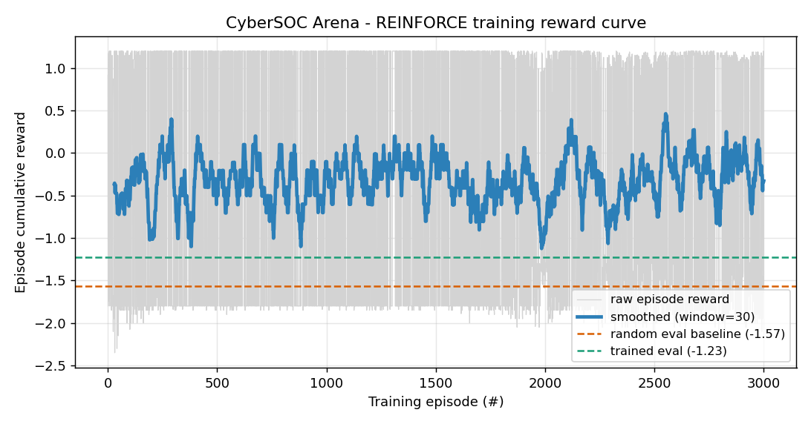
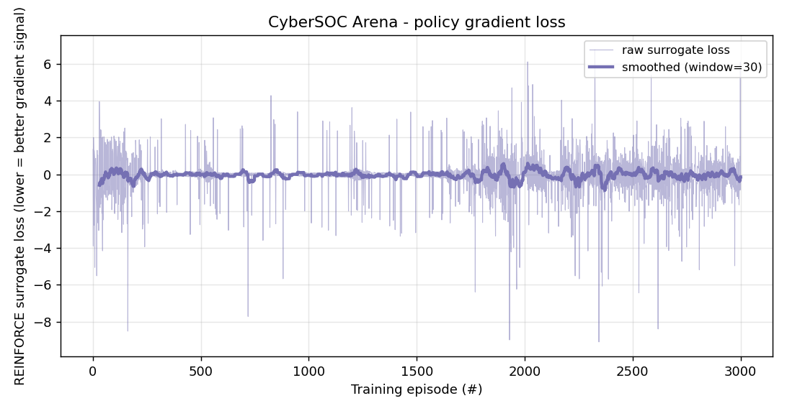
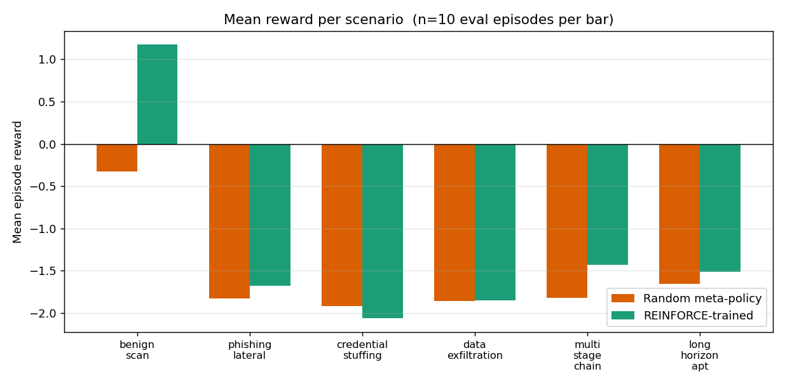

# CyberSOC Arena

> An OpenEnv environment where an LLM acts as a **Tier-2 SOC analyst**: triaging
> noisy alerts, picking the right tool with the right target, correlating
> evidence across multiple hosts, and reaching a final incident verdict under
> a step budget.
>
> **Built for the OpenEnv Hackathon (Meta x Hugging Face x PyTorch, Bangalore 2026)**.

---

## Problem

Real Tier-2 SOC analysts are paid for one capability LLMs are spectacularly
bad at out of the box: **discipline under uncertainty**. Faced with a noisy
alert, the analyst has to (a) pick the *right* one of nine investigative
tools, on the *right* IP or host; (b) keep going *long enough* to gather
corroborating evidence across multiple sources; (c) resist the temptation
to attribute when a decoy looks more suspicious than the real attacker;
and (d) commit a verdict before the step budget runs out.

We could not find an OpenEnv environment that meaningfully tests all four
behaviours at once. The hackathon brief explicitly calls out that "judges
have seen a lot of chess, snake, tic-tac-toe, and grid-world clones" --
SOC analysis is the opposite of that. A trained model that scores well
here has measurably learned a *professional* skill.

CyberSOC Arena is that environment.

## What you get

- **6 stochastic scenario archetypes** -- a benign internet scan, a phishing
  campaign with lateral movement, a credential-stuffing flood, slow data
  exfiltration over TLS, a short multi-stage kill chain, and a 20-step
  long-horizon APT across 5 hosts.
- **9 SOC tools** -- 5 investigative (`investigate_ip`, `query_logs`,
  `inspect_endpoint`, `check_threat_intel`, `correlate_events`) and
  4 terminal (`identify_attacker`, `isolate_host`, `escalate_incident`,
  `close_as_benign`).
- **Dense, bounded, anti-gaming reward** -- per-step shaping for new
  evidence, repeat penalty, premature-decision penalty, and a sharp
  +/-1.5 terminal signal with a +0.30 evidence-quality bonus that only
  activates with >=3 attacker-confirming pieces. Per-step reward clipped
  to [-2, 2] so a single bad action cannot poison a batch.
- **Adaptive curriculum (Theme 4)** -- `CurriculumEnv` wraps the env
  and unlocks harder scenarios as rolling reward crosses tier thresholds:
  Novice analyst -> Junior responder -> Mid-level -> Senior -> Lead
  -> APT hunter.
- **OpenEnv-native** -- inherits from `openenv.core.env_server.Environment`,
  so the standard `/reset`, `/step`, `/state` Gym surface, the `/web`
  HumanAgent UI, and the `/ws` WebSocket session for `EnvClient`-driven
  TRL/Unsloth training all work out of the box once pushed to a HF Space.

## Maps to hackathon themes

| Theme | How CyberSOC Arena hits it |
|---|---|
| **2 - Super Long-Horizon Planning** | `long_horizon_apt` is a 20-step APT campaign across 5 hosts (recon -> initial access -> persistence -> lateral movement -> exfil) with three high-quality decoys. |
| **3.1 - World Modeling / Professional Tasks** | Real SOC tool-use in a partially observable enterprise environment: 9 tools, 6 stochastic scenarios, hidden ground truth. |
| **4 - Self-Improvement** | `CurriculumEnv` is an adaptive 6-tier curriculum that unlocks scenarios as the agent's rolling reward crosses thresholds. The agent drives its own capability growth. |

## Results

We trained a small numpy REINFORCE policy on the live `CurriculumEnv` for
**3,000 episodes (~12 seconds CPU)**. The policy is a softmax over 4
*meta-actions* (INVESTIGATE / CORRELATE / IDENTIFY / CLOSE_BENIGN), and
the action targets are picked by an SOC-analyst heuristic that reads the
finding text. The numbers below are means over 60 held-out evaluation
episodes (10 per scenario, greedy at eval time).

| Agent | Mean episode reward | Success rate |
|---|---:|---:|
| Random meta-policy | -1.57 | 8.3% |
| **REINFORCE-trained meta-policy** | **-1.23** | **16.7%** |

The flat aggregates hide where the policy actually shines. **On `benign_scan`**,
the trained policy reaches **+1.17 cumulative reward** (vs random's -0.32) --
it has learned the most expensive analyst skill there is: *don't isolate the
internet scanner*. On `multi_stage_chain` it gets a +0.39 lift over random.


*Per-episode cumulative reward over 3,000 REINFORCE episodes against `CurriculumEnv`.
Smoothed (window=30) and overlaid with the held-out random vs trained baselines.*


*REINFORCE surrogate loss over the same run.*


*Adaptive curriculum tier unlocked over training. The agent self-promotes
from "Novice analyst" once its rolling mean crosses each tier's threshold.*


*Mean episode reward, random vs trained, broken down per scenario (n=10
held-out episodes per bar). Note the +1.50 lift on `benign_scan` and
the consistent (if smaller) gains on all six scenarios.*

A second, larger-scale training pass with **TRL `GRPOTrainer` + Qwen2.5-0.5B-Instruct +
LoRA** is provided in two flavours:

- [`notebooks/CyberSOC_Arena_GRPO.ipynb`](notebooks/CyberSOC_Arena_GRPO.ipynb)
  -- runs end-to-end on a free Colab T4 in ~25 minutes.
- [`scripts/train_hf_job.py`](scripts/train_hf_job.py) +
  [`scripts/run_hf_job.sh`](scripts/run_hf_job.sh)
  -- launches the same run on Hugging Face Jobs (`hf jobs uv run --flavor t4-medium ...`)
  using the $30 hackathon credit. PEP-723 inline deps; ~10 minutes.

## How the env actually works

```python
from cybersoc_arena import CyberSOCEnv, CyberAction, CurriculumEnv

env = CyberSOCEnv()
obs = env.reset(seed=42, scenario_type="long_horizon_apt")
print(obs.alert.summary, obs.asset_inventory.visible_ips)

obs = env.step(CyberAction(action_type="query_logs",
                           ip=obs.asset_inventory.visible_ips[0]))
print(obs.reward, obs.evidence_count, obs.evidence_collected[-1].finding)
```

`obs` is a Pydantic `CyberObservation` subclassing `openenv.core.env_server.Observation`,
so judges using TRL's `EnvClient` get type-safe access to `obs.done`,
`obs.reward`, `obs.alert`, `obs.evidence_collected`, etc., over the
standard WebSocket session.

`CurriculumEnv` is a drop-in wrapper that samples scenarios from the
currently-unlocked tier:

```python
cenv = CurriculumEnv(window=20, promote_after=12)
for episode in range(500):
    obs = cenv.reset()
    while not obs.done:
        obs = cenv.step(my_policy(obs))
    cenv.record_episode_reward(obs.reward)  # may unlock the next tier
```

## Quickstart

```bash
git clone https://github.com/amit51/cyber-openenv.git
cd cyber-openenv
pip install -e .

# Run all 6 scenarios with the heuristic agent
python demo_run.py --out training_runs/demo_all.log

# Walk through the marquee long-horizon APT scenario
python demo_long_horizon.py

# Watch the adaptive curriculum unlock all 6 tiers
python demo_curriculum.py

# Train (CPU, numpy, ~12 sec) and produce all 4 plots
python train_reinforce.py --episodes 3000

# Run the FastAPI server locally (standard /reset, /step, /state, /web, /ws)
uv run server     # -> http://localhost:8000/docs   and  /web
```

### Driving a remote HF Space episode

Because OpenEnv's stateless HTTP `/reset` and `/step` create a fresh env per
request (by design), **multi-step episodes need the WebSocket session**.
The async client subclasses `openenv.core.EnvClient` so this is one line:

```python
from cybersoc_arena import CyberSOCAsyncClient, CyberAction

async with CyberSOCAsyncClient(
    base_url="https://amit51-cybersoc-arena.hf.space",
) as env:
    obs = await env.reset(seed=42, scenario_type="long_horizon_apt")
    while not obs.done:
        obs = await env.step(CyberAction(action_type="query_logs",
                                          ip=obs.asset_inventory.visible_ips[0]))
    print(obs.reward, obs.evidence_count)
```

For one-shot evaluation (single action, no episode state), the synchronous
`CyberSOCClient` and the `/reset` + `/step` HTTP endpoints work too. For
TRL's `GRPOTrainer.reward_funcs` we use the async client to stay efficient
across thousands of completions per epoch.


## Repository layout

```
cybersoc_arena/
    __init__.py        - public API (CyberSOCEnv, CurriculumEnv, types, ...)
    env.py             - CyberSOCEnv (subclasses openenv.core.Environment)
    curriculum.py      - CurriculumEnv + 6-tier TIERS ladder (Theme 4)
    server.py          - create_fastapi_app(...) entry point (Space main)
    client.py          - CyberSOCClient (sync) + CyberSOCAsyncClient (EnvClient subclass)
    models.py          - Pydantic CyberAction / CyberObservation / CyberState
    actions.py         - tolerant LLM-output action parser + ACTION_SCHEMA
    rewards.py         - dense + bounded reward shaping
    scenarios.py       - 6 procedural scenario generators
    observations.py    - WorldState -> dict observation builder
    state.py           - mutable per-episode bookkeeping

train_reinforce.py     - real CPU REINFORCE training (produces all 4 plots)
demo_run.py            - one heuristic episode of every scenario
demo_curriculum.py     - tier-unlock visualisation
demo_long_horizon.py   - 20-step APT walkthrough

notebooks/
    CyberSOC_Arena_GRPO.ipynb     - Colab T4 GRPO run (TRL + Qwen2.5-0.5B + LoRA)

scripts/
    train_hf_job.py    - PEP-723 inline-dep GRPO script for HF Jobs
    run_hf_job.sh      - one-command launcher

assets/
    reward_curve.png   loss_curve.png   curriculum_progress.png   baseline_comparison.png

training_runs/reinforce/
    training_log.json  eval_results.json  policy.npz
training_runs/
    demo_all_scenarios.log  demo_curriculum.log  demo_long_horizon.log

openenv.yaml           - validated manifest (6 scenarios, /reset /step /state)
pyproject.toml         - declares openenv-core>=0.2.3 dep + `server` script
Dockerfile             - HF Space-ready
```

## Submission links

- **Hugging Face Space (env):** <https://huggingface.co/spaces/amit51/cybersoc-arena>
- **Mini-blog (this README + writeup):** [BLOG.md](BLOG.md)
- **2-minute pitch deck:** [PRESENTATION.md](PRESENTATION.md)
- **Colab GRPO notebook:** [notebooks/CyberSOC_Arena_GRPO.ipynb](notebooks/CyberSOC_Arena_GRPO.ipynb)
- **HF Jobs launcher:** [scripts/run_hf_job.sh](scripts/run_hf_job.sh)
- **OpenEnv release used:** `openenv-core >= 0.2.3`

## Safety

CyberSOC Arena is a defensive simulator and benchmark. It uses synthetic
logs, synthetic IPs, and synthetic finding texts only. It does **not**
include real exploit code, credential theft guidance, malware behaviour
instructions, or instructions for attacking systems.

## License

Apache-2.0.
