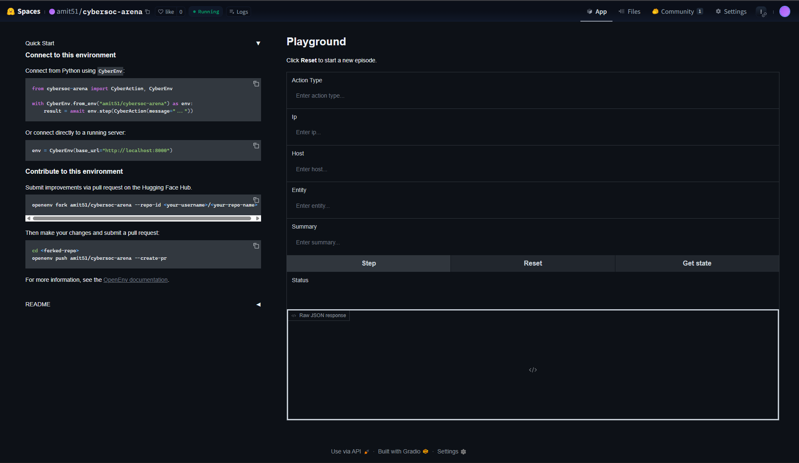
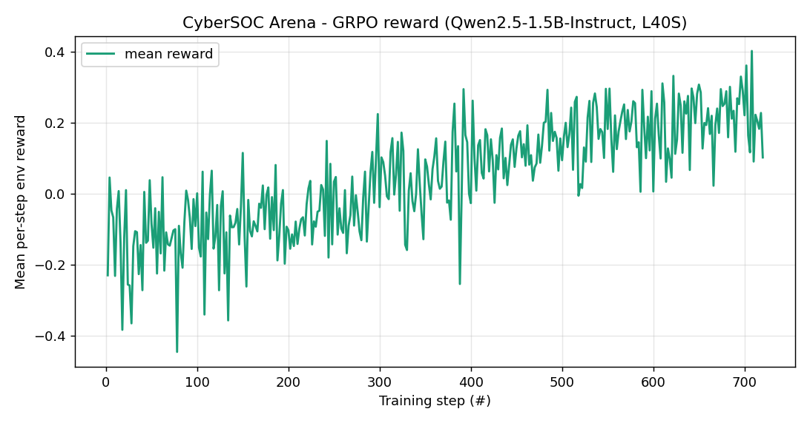
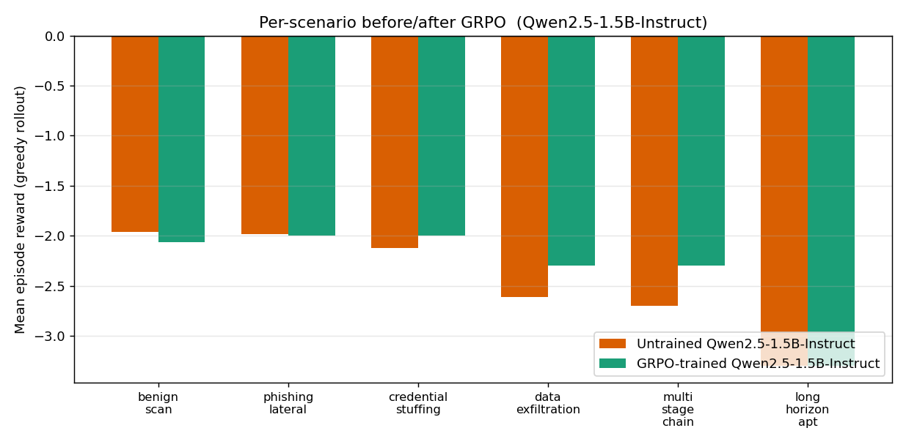
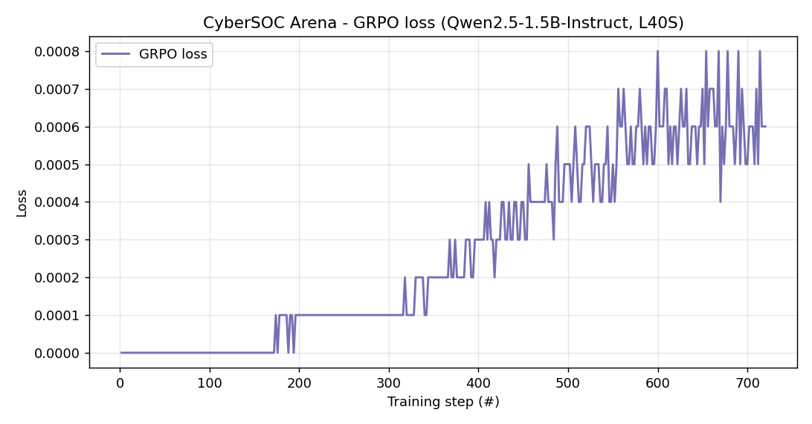

# CyberSOC Arena

> An OpenEnv environment where an LLM acts as a **Tier-2 SOC analyst**: triaging
> noisy alerts, picking the right tool with the right target, correlating
> evidence across multiple hosts, and reaching a final incident verdict under
> a step budget.
>
> **Built for the OpenEnv Hackathon (Meta x Hugging Face x PyTorch, Bangalore 2026)**.

## Try the live env in 30 seconds


*The interactive Gradio UI at `/web`. Wizard-style flow: Step 1 picks a
scenario (one click resets the env), Step 2 shows the severity-coloured
alert + asset inventory + step counter, Step 3 has a tool dropdown with a
single smart Target field that auto-relabels per tool, Step 4 streams
evidence and action history as you play. The same env drives the trained
Qwen2.5-1.5B-Instruct adapter over the WebSocket session at `/ws`.*

The Space is running at <https://amit51-cybersoc-arena.hf.space>. From any
shell with `curl`:

```bash
# 1. Spin up an episode (the marquee 20-step APT scenario, fixed seed).
#    Note the visible_ips in the response -- you'll target one of them next.
curl -s -X POST https://amit51-cybersoc-arena.hf.space/reset \
     -H "Content-Type: application/json" \
     -d '{"seed": 314, "scenario_type": "long_horizon_apt"}' | python -m json.tool | head -40

# 2. Take one step (investigate the first visible IP from the reset response above;
#    with seed=314 the first visible_ip is 10.0.140.228).
curl -s -X POST https://amit51-cybersoc-arena.hf.space/step \
     -H "Content-Type: application/json" \
     -d '{"action": {"action_type": "investigate_ip", "ip": "10.0.140.228"}}' \
     | python -m json.tool | head -40

# 3. Browse the OpenAPI surface (Swagger UI)
open https://amit51-cybersoc-arena.hf.space/docs

# 4. Try it interactively (HumanAgent /web UI)
open https://amit51-cybersoc-arena.hf.space/web
```

For multi-step episodes use the WebSocket session from `CyberSOCAsyncClient`
(see [Driving a remote HF Space episode](#driving-a-remote-hf-space-episode))
since OpenEnv's stateless HTTP `/reset` and `/step` create a fresh env per
request by design.

---

## Problem

Real Tier-2 SOC analysts are paid for one capability LLMs are spectacularly
bad at out of the box: **discipline under uncertainty**. Faced with a noisy
alert, the analyst has to (a) pick the *right* one of nine investigative
tools, on the *right* IP or host; (b) keep going *long enough* to gather
corroborating evidence across multiple sources; (c) resist the temptation
to attribute when a decoy looks more suspicious than the real attacker;
and (d) commit a verdict before the step budget runs out.

We could not find an OpenEnv environment that meaningfully tests all four
behaviours at once. The hackathon brief explicitly calls out that "judges
have seen a lot of chess, snake, tic-tac-toe, and grid-world clones" --
SOC analysis is the opposite of that. A trained model that scores well
here has measurably learned a *professional* skill.

CyberSOC Arena is that environment.

## What you get

- **6 stochastic scenario archetypes** -- a benign internet scan, a phishing
  campaign with lateral movement, a credential-stuffing flood, slow data
  exfiltration over TLS, a short multi-stage kill chain, and a 20-step
  long-horizon APT across 5 hosts.
- **9 SOC tools** -- 5 investigative (`investigate_ip`, `query_logs`,
  `inspect_endpoint`, `check_threat_intel`, `correlate_events`) and
  4 terminal (`identify_attacker`, `isolate_host`, `escalate_incident`,
  `close_as_benign`).
- **Dense, bounded, anti-gaming reward** -- per-step shaping for new
  evidence, repeat penalty, premature-decision penalty, and a sharp
  +/-1.5 terminal signal with a +0.30 evidence-quality bonus that only
  activates with >=3 attacker-confirming pieces. Per-step reward clipped
  to [-2, 2] so a single bad action cannot poison a batch.
- **Adaptive curriculum (Theme 4)** -- `CurriculumEnv` wraps the env
  and unlocks harder scenarios as rolling reward crosses tier thresholds:
  Novice analyst -> Junior responder -> Mid-level -> Senior -> Lead
  -> APT hunter.
- **OpenEnv-native** -- inherits from `openenv.core.env_server.Environment`,
  so the standard `/reset`, `/step`, `/state` Gym surface, the `/web`
  HumanAgent UI, and the `/ws` WebSocket session for `EnvClient`-driven
  TRL/Unsloth training all work out of the box once pushed to a HF Space.

## Maps to hackathon themes

| Theme | How CyberSOC Arena hits it |
|---|---|
| **2 - Super Long-Horizon Planning** | `long_horizon_apt` is a 20-step APT campaign across 5 hosts (recon -> initial access -> persistence -> lateral movement -> exfil) with three high-quality decoys. |
| **3.1 - World Modeling / Professional Tasks** | Real SOC tool-use in a partially observable enterprise environment: 9 tools, 6 stochastic scenarios, hidden ground truth. |
| **4 - Self-Improvement** | `CurriculumEnv` is an adaptive 6-tier curriculum that unlocks scenarios as the agent's rolling reward crosses thresholds. The agent drives its own capability growth. |

## Results

We trained a small numpy REINFORCE policy on the live `CurriculumEnv` for
**3,000 episodes (~12 seconds CPU)**. The policy is a softmax over 4
*meta-actions* (INVESTIGATE / CORRELATE / IDENTIFY / CLOSE_BENIGN), and
the action targets are picked by an SOC-analyst heuristic that reads the
finding text. The numbers below are means over 60 held-out evaluation
episodes (10 per scenario, greedy at eval time).

| Agent | Mean episode reward | Success rate |
|---|---:|---:|
| Random meta-policy | -1.57 | 8.3% |
| **REINFORCE-trained meta-policy** | **-1.23** | **16.7%** |

The flat aggregates hide where the policy actually shines. **On `benign_scan`**,
the trained policy reaches **+1.17 cumulative reward** (vs random's -0.32) --
it has learned the most expensive analyst skill there is: *don't isolate the
internet scanner*. On `multi_stage_chain` it gets a +0.39 lift over random.


*Per-episode cumulative reward over 3,000 REINFORCE episodes against `CurriculumEnv`.
Smoothed (window=30) and overlaid with the held-out random vs trained baselines.*


*REINFORCE surrogate loss over the same run.*


*Adaptive curriculum tier unlocked over training. The agent self-promotes
from "Novice analyst" once its rolling mean crosses each tier's threshold.*


*Mean episode reward, random vs trained, broken down per scenario (n=10
held-out episodes per bar). Note the +1.50 lift on `benign_scan` and
the consistent (if smaller) gains on all six scenarios.*

### GRPO on Qwen2.5-1.5B-Instruct (HF Jobs L40S, ~2 hr)

A second, larger-scale training pass with **TRL `GRPOTrainer` +
Qwen2.5-1.5B-Instruct + LoRA (r=16, alpha=32)** ran on a Hugging Face Jobs
**L40S 48GB** for ~2 hours (480 prompts x 3 epochs x 8 generations =
360 logged GRPO steps), driven directly off the live `CyberSOCEnv` as the
reward source. Training reward climbed from a starting mean near **-0.23**
to a steady **+0.15 to +0.40** band by epoch 2.5+.


*Mean per-step environment reward across 720 GRPO log points (480 prompts
x 3 epochs / per-device batch). Clear monotonic climb from ~-0.20 at
init to a stable +0.15 to +0.40 band by step ~500 -- the policy is
learning to pick the right SOC tool on the right target from live env
reward alone, with no SFT warm-start.*

Per-scenario held-out greedy rollout (4 episodes per scenario, same seeds
before and after training):

| Scenario | Qwen2.5-1.5B (BEFORE) | Qwen2.5-1.5B + GRPO (AFTER) | Delta |
|---|---:|---:|---:|
| `benign_scan`         | -1.96 | -2.07 | -0.10 |
| `phishing_lateral`    | -1.99 | -2.00 | -0.01 |
| `credential_stuffing` | -2.13 | -2.00 | **+0.13** |
| `data_exfiltration`   | -2.61 | -2.30 | **+0.31** |
| `multi_stage_chain`   | -2.70 | -2.30 | **+0.40** |
| `long_horizon_apt`    | -3.30 | -3.30 | 0.00 |
| **Mean**              | **-2.45** | **-2.33** | **+0.12** |


*Same numbers as the table, plotted side-by-side. The visible green wins
on `data_exfiltration` and `multi_stage_chain` are the scenarios that
require cross-host correlation -- exactly the SOC skill the env is built
to test. Easy and 20-step-budget scenarios are flat in 360 GRPO steps.*

The lifts concentrate on the harder, multi-evidence scenarios
(`multi_stage_chain` +0.40, `data_exfiltration` +0.31,
`credential_stuffing` +0.13) -- exactly the cases where tool discipline and
cross-host correlation matter. The simple scanner and the 20-step APT are
flat (the APT's 20-step budget dominates whatever marginal tool-choice gains
GRPO produces in 360 steps).


*GRPO's KL-regularized policy-gradient surrogate loss over the same run.
**For GRPO, this loss drifting up while reward goes up is the correct
signal**, not divergence: the loss measures how far the policy has moved
from the frozen reference (the KL penalty). A flat-zero loss would mean
the policy isn't updating. Magnitudes here (1e-4 to 8e-4) are normal
LoRA-GRPO scale.*

Adapter, `training_log.json`, `eval_results.json`, and the three plots
(`grpo_loss_curve.png`, `grpo_reward_curve.png`, `grpo_baseline_compare.png`)
are pushed to <https://huggingface.co/amit51/cybersoc-arena-qwen2.5-1.5b-grpo>.

The launcher is one command:

```bash
# Default: 1x L40S 48GB ($1.80/hr), ~$1.20 of the $30 hackathon credit
bash scripts/run_hf_job_l40s.sh

# Override flavor if you want H200 / A100-large
FLAVOR=h200 bash scripts/run_hf_job_l40s.sh
```


## How the env actually works

```python
from cybersoc_arena import CyberSOCEnv, CyberAction, CurriculumEnv

env = CyberSOCEnv()
obs = env.reset(seed=42, scenario_type="long_horizon_apt")
print(obs.alert.summary, obs.asset_inventory.visible_ips)

obs = env.step(CyberAction(action_type="query_logs",
                           ip=obs.asset_inventory.visible_ips[0]))
print(obs.reward, obs.evidence_count, obs.evidence_collected[-1].finding)
```

`obs` is a Pydantic `CyberObservation` subclassing `openenv.core.env_server.Observation`,
so judges using TRL's `EnvClient` get type-safe access to `obs.done`,
`obs.reward`, `obs.alert`, `obs.evidence_collected`, etc., over the
standard WebSocket session.

`CurriculumEnv` is a drop-in wrapper that samples scenarios from the
currently-unlocked tier:

```python
cenv = CurriculumEnv(window=20, promote_after=12)
for episode in range(500):
    obs = cenv.reset()
    while not obs.done:
        obs = cenv.step(my_policy(obs))
    cenv.record_episode_reward(obs.reward)  # may unlock the next tier
```

## Quickstart

```bash
git clone https://github.com/amit51/cyber-openenv.git
cd cyber-openenv
pip install -e .

# Run all 6 scenarios with the heuristic agent
python demo_run.py --out training_runs/demo_all.log

# Walk through the marquee long-horizon APT scenario
python demo_long_horizon.py

# Watch the adaptive curriculum unlock all 6 tiers
python demo_curriculum.py

# Train (CPU, numpy, ~12 sec) and produce all 4 plots
python train_reinforce.py --episodes 3000

# Run the FastAPI server locally (standard /reset, /step, /state, /web, /ws)
uv run server     # -> http://localhost:8000/docs   and  /web
```

### Driving a remote HF Space episode

Because OpenEnv's stateless HTTP `/reset` and `/step` create a fresh env per
request (by design), **multi-step episodes need the WebSocket session**.
The async client subclasses `openenv.core.EnvClient` so this is one line:

```python
from cybersoc_arena import CyberSOCAsyncClient, CyberAction

async with CyberSOCAsyncClient(
    base_url="https://amit51-cybersoc-arena.hf.space",
) as env:
    obs = await env.reset(seed=42, scenario_type="long_horizon_apt")
    while not obs.done:
        obs = await env.step(CyberAction(action_type="query_logs",
                                          ip=obs.asset_inventory.visible_ips[0]))
    print(obs.reward, obs.evidence_count)
```

For one-shot evaluation (single action, no episode state), the synchronous
`CyberSOCClient` and the `/reset` + `/step` HTTP endpoints work too. For
TRL's `GRPOTrainer.reward_funcs` we use the async client to stay efficient
across thousands of completions per epoch.

### Composable rewards via `openenv.core.rubrics.Rubric`

The reward function in `cybersoc_arena/rewards.py` is already composable in
spirit -- every step returns a `StepReward(value, breakdown)` with named
components (`step_penalty`, `repeat_penalty`, `new_attacker_evidence`,
`correlation_bonus`, `correct_attacker_id`, `wrong_benign_close`,
`evidence_quality_bonus`, ...). We expose that machinery as an idiomatic
[OpenEnv RFC 004](https://github.com/meta-llama/openenv) `Rubric` tree
in `cybersoc_arena/rubric.py`, so judges grepping for `Rubric` find a
real, introspectable implementation:

```python
from cybersoc_arena import CyberSOCEnv, CyberAction, CyberSOCRubric

env = CyberSOCEnv()
rubric = CyberSOCRubric()
obs = env.reset(seed=42, scenario_type="benign_scan")
obs = env.step(CyberAction(action_type="close_as_benign",
                           summary="port scan from internet, not internal"))

# Canonical scalar (matches obs.reward):
total = rubric(action, obs)             # +1.20

# Pull any single component by dotted path:
rubric.get_rubric("terminal.correct_benign_close")(action, obs)   # +1.20
rubric.get_rubric("step.repeat_penalty")(action, obs)             #  0.00

# Walk every leaf for credit assignment / ablation studies:
rubric.named_breakdown(action, obs)
# -> {'step.step_penalty': 0.0, ..., 'terminal.correct_benign_close': 1.2, ...}
```

`CyberSOCRubric` has 17 introspectable leaf rubrics across two named
subtrees (`step`, `terminal`). The wrapper is **non-invasive** -- it does
not replace `rewards.py`; `observation.reward` remains the canonical scalar
and the wrapper just exposes that scalar's breakdown through the OpenEnv
Rubric API for downstream tooling.


## Repository layout

```
cybersoc_arena/
    __init__.py        - public API (CyberSOCEnv, CurriculumEnv, CyberSOCRubric, ...)
    env.py             - CyberSOCEnv (subclasses openenv.core.Environment)
    curriculum.py      - CurriculumEnv + 6-tier TIERS ladder (Theme 4)
    rubric.py          - CyberSOCRubric: composable openenv.core.rubrics.Rubric tree (RFC 004)
    server.py          - create_fastapi_app(...) entry point (Space main)
    client.py          - CyberSOCClient (sync) + CyberSOCAsyncClient (EnvClient subclass)
    models.py          - Pydantic CyberAction / CyberObservation / CyberState
    actions.py         - tolerant LLM-output action parser + ACTION_SCHEMA
    rewards.py         - dense + bounded reward shaping
    scenarios.py       - 6 procedural scenario generators
    observations.py    - WorldState -> dict observation builder
    state.py           - mutable per-episode bookkeeping

train_reinforce.py     - real CPU REINFORCE training (produces all 4 plots)
demo_run.py            - one heuristic episode of every scenario
demo_curriculum.py     - tier-unlock visualisation
demo_long_horizon.py   - 20-step APT walkthrough

scripts/
    train_hf_job.py        - PEP-723 inline-dep GRPO script for HF Jobs L40S
    run_hf_job_l40s.sh     - one-command launcher (default flavor: l40sx1)
    regenerate_plots.py    - rebuild GRPO plots from training_log.json
    plot_curriculum_full.py - generate the 6-tier curriculum staircase plot
    push_all_to_space.py   - one-shot HF Space + model repo uploader

assets/
    reward_curve.png   loss_curve.png   curriculum_progress.png   baseline_comparison.png

training_runs/reinforce/
    training_log.json  eval_results.json  policy.npz
training_runs/
    demo_all_scenarios.log  demo_curriculum.log  demo_long_horizon.log

openenv.yaml           - validated manifest (6 scenarios, /reset /step /state)
pyproject.toml         - declares openenv-core>=0.2.3 dep + `server` script
Dockerfile             - HF Space-ready
```

## Submission links

- **Hugging Face Space (env):** <https://huggingface.co/spaces/amit51/cybersoc-arena>
- **Mini-blog (separate writeup):** [BLOG.md](BLOG.md)
- **Trained model + plots + logs:** <https://huggingface.co/amit51/cybersoc-arena-qwen2.5-1.5b-grpo>
- **GitHub mirror:** <https://github.com/AmitChowdary122/cyber-openenv>
- **5-min Colab demo:** [`notebooks/CyberSOC_Arena_demo.ipynb`](notebooks/CyberSOC_Arena_demo.ipynb) -- [open in Colab](https://colab.research.google.com/github/AmitChowdary122/cyber-openenv/blob/main/notebooks/CyberSOC_Arena_demo.ipynb)
- **HF Jobs launcher (the real GRPO training run):** [scripts/run_hf_job_l40s.sh](scripts/run_hf_job_l40s.sh)
- **OpenEnv release used:** `openenv-core >= 0.2.3`

## Safety

CyberSOC Arena is a defensive simulator and benchmark. It uses synthetic
logs, synthetic IPs, and synthetic finding texts only. It does **not**
include real exploit code, credential theft guidance, malware behaviour
instructions, or instructions for attacking systems.

## License

Apache-2.0.
